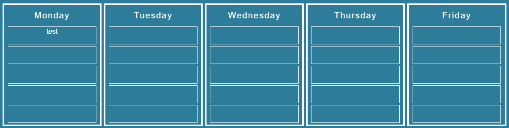

<h1 align="center">
   
  
</h1>

<h2 align="center">A simple week planner that stay always on the background</h2>

  
   
  

      
---

*Note: The background is transparent.

---

      
## How to Use

Just download the zip file, extract it wherever you want. Execute the BackPlanner.exe, and Enjoy!
You will not see the menu bar icon app, instead you'll find the tray icon(in the bottom right corner) where you can quit the app.
I have not yet implemented an auto-update feature, so when in the menu of the tray icon there will be written "Update Available", just click on it and download the new version.

If you want the app to start when windows start, just follow this steps:

* Select the Start  button and scroll to find the app you want to run at startup.

* Right-click the app, select More, and then select Open file location. This opens the location where the shortcut to the app is saved. If there isn't an option for Open file location, it means the app can't run at startup.

* With the file location open, press the Windows logo key  + R, type shell:startup, then select OK. This opens the Startup folder.

* Copy and paste the shortcut to the app from the file location to the Startup folder.  

**NOTE** →  The app starts with ignore mouse events, so it is like it doesn't exist(you can even move a file/folder behind it), to make change just press CTRL+K, and you will be able to modify your plan with double-click on the boxes, when you will click on another window, the app will reset the starting ignore mouse event.

In this way we avoid the accidental clicks.

## Before Starting It

Before starting the app, open the settings file with the editor you want(wordpad,vscode...)  
Here you have 7 variables:  

* **height** →  This refers to the pixel number in height(this feature will be implemented shortly)  
* **width** →  Change this number according to the width of the app, if it is too big just lower the number(the content will resize automatically).  
* **xpos** →  The position on the x axis(Horizontal)  
* **ypos** →  The position on the y axis(Vertical)  
* **textcolor** →  Color for the text  
* **textareacolor** →  Color for the border around the text  
* **bordercolor** →  Color of the external border  

You can choose a color between this collection:  http://www.colors.commutercreative.com/grid/  
Just substitute the color name, so for example: instead of "white" → "darkblue"

Now start the exe, or if you have already started it, quit and start again so that changes will be saved.  
You may have to make some attempt in order to find the perfect setting for you.  

**Enjoy!**  
**Remember: To add or change text in the boxes just double-click!**  
      
      
      
## License

- Copyright © [CheckMate](https://github.com/ch-ckmate).
